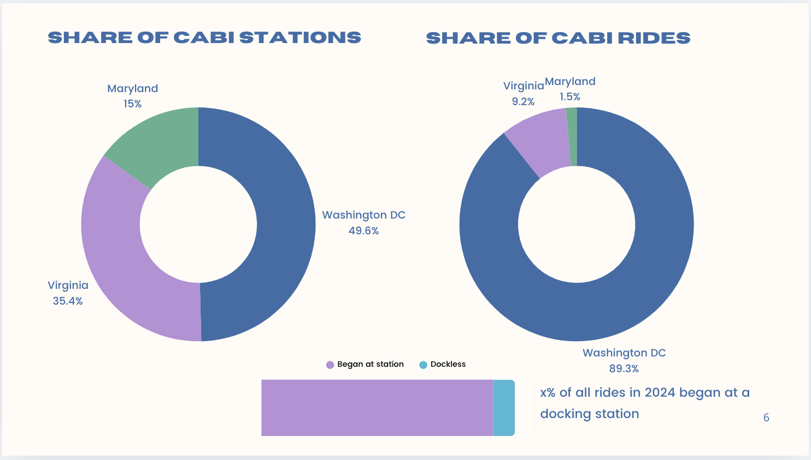
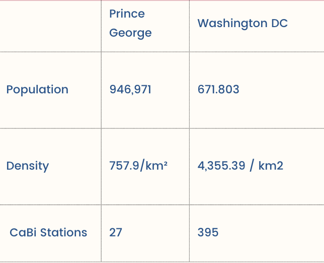
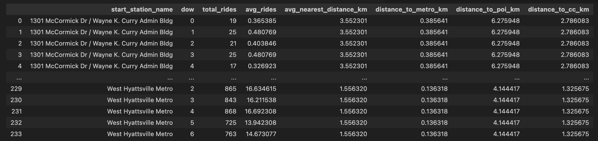
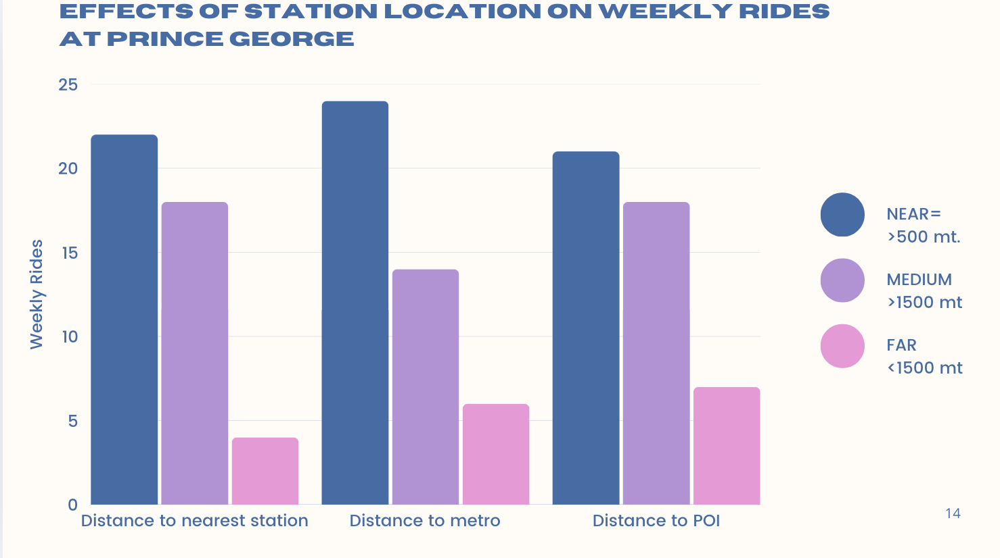
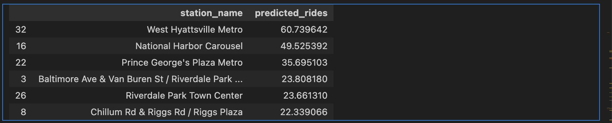

# 🚴 Capital Bikeshare Demand Analysis

This project analyzes **bike ride demand** of Capital Bikeshare (CaBi) system in the Washington DC and Metropolitan area using spatial features.  
It explores how **bike station location** and it's **proximity** to other bike stations, public transport, commercial corridors, etc. influence ride volume.

## About Cabi
Capital Bikeshare is a bike-sharing company that operates in the Washington, D.C. metropolitan area, including parts of Virginia and Maryland. It provides a network of docked bicycles that users can rent for short trips. 

CaBi broke the all-time monthly ridership record in August 2024 with 614,639 rides. This is a 31.1% increase in system use from August 2023 and marks the fourth consecutive month where CaBi has shattered its previous milestone for busiest month on record. The regional network has experienced year-over-year monthly ridership increases for 32 consecutive months. Annual ridership continues to thrive as 3,788,634 trips have been taken in 2024—a 31.3% increase from a year prior.

## Share of CaBi rides and Stations per Region



## ❓ Triggering Questions

- What factors make some bike stations busier than others?
- Are high-demand stations located near specific urban features (e.g., metro stations, commercial corridors)?
- Why does Capital Bikeshare perform significantly better in Washington, DC compared to Maryland?

These questions guided the direction of this project. After an initial exploration of the CaBi system across the entire region, I decided to focus on an area with notably lower ridership: **Prince George’s County, Maryland**. This regional contrast offered a compelling opportunity to explore how geography and infrastructure influence bikeshare demand.

**Prince George County / Washington DC comparison**


---

## 📌 Project Overview

- 📍 **Primary Objectives:** 
  1) Analize the relationship (if any) between geographical location of a given station and ride demand
  2) Predict ride demand for given stations in a determined period of time
  3) Guide policy decision in station placement

- 🗃️ **Data Sources:**

  - [Capital Bikeshare Trip Data (2021–2024)](https://s3.amazonaws.com/capitalbikeshare-data/index.html)  
  Weekly bike trip logs for all CaBi stations across Washington, DC and surrounding metro areas.

  - [Washington, DC Open Data Portal](https://opendata.dc.gov/datasets)  
  Geospatial data used for public transport locations, neighborhood boundaries, bike lanes, landmarks, and population metrics.

  - [Greater Greater Washington Analysis](https://ggwash.org/view/97701/cabi-is-a-huge-success-will-its-structure-allow-it-to-keep-growing-regionally)  
  Background information and urban planning commentary used to contextualize performance gaps in Prince George County.

---

## Methodoloy

### Data Collection
- Collected geographical information of Cabi stations,public transport stations, points of interest, distance to city center and population density
### Analizing
- Mapped the information in the map to get a visual representation.
- Calculated distances between the location parameters and the stations.
- Compared the results with the average number of rides per station.

### Testing
Deploy machine learning model to:
- Predict the demand 
- Optimize Station Placement

---
## 🗺️ Interactive Map Preview


🔗 [Click here to explore the full interactive map](https://pabs-llama.github.io/capital-bikeshare-analysis/interactive_cabi_map.html)

## 🔍 Key Insights

- Stations closer to each other, metro and other points of interest have consistently higher demand:



- If a bikeshare station is full or empty, another needs to be in proximity for bikeshare to be a reliable, go-to option to get around. That’s not the case in much of CaBi’s suburban service area like Prince George County, where officials often opt to sprinkle a few docks here or there without attention to whether station density makes bikeshare competitive with driving or even walking.

  In Maryland, CaBi lacks coherence or the density necessary for a high-usage system. A lot of dockless    bikes, indicated in white, very sparse stations, and a hole with no service at the University of Maryland:


Top: Bikeshare in western Prince George’s County (Maryland) / Bottom: Cabi in Washington, D.C

- Machine Learning Predictions: 
  - Model: Random Forest Regressor (gave the best results )
  - Target : Prediction of bikes demand per station 
  - Features: Proximity to other bike stations, metro and points of interest. 
  - Period of time: weekly, from 2022 to 2024
  - Limit: Prince George County
  - Results: 
    - Mean Absolute Error: 4.49. Since the Mean Weekly Rides is 16, the MAE is  25% off the mean. This mean the model is making pretty accurate predictions.
    - R² Score: 0.87 of the variance in weekly rides is explained by the model
    - Mean Weekly Rides: 16.33
    - Standard Deviation of Weekly Rides: 19.25. The standard deviation of Weekly rides is 3.12, which is larger than the MAE. This suggests that the model is making much smaller errors than the natural variability in the data, indicating a strong fit.

---

## Actionable insights:

1) Rank stations by predicted ride demand and identify the top 10% busiest stations.
Ensure high-demand stations have enough bikes/docks to meet peak demand.
Consider adding more stations nearby if existing ones are frequently at capacity. For example:


2) if near-metro stations consistently show higher demand, prioritize new stations near transit hubs.
If demand is low near POIs, consider marketing efforts or incentives to boost usage.

3) Identify the bottom 10% least-used stations.
Analyze their distance to metro, POIs, and population density to understand why demand is low.
Consider relocating low-use stations to denser areas or adjusting marketing strategies.

## 🧪 Techniques Used

- Pandas, GeoPandas, Matplotlib, Folium
- Distance calculations with geospatial data
- Machine Learning
- Time series aggregation
- Data visualization & clustering

---
## 🔍 Notebooks of Interest

- `01_distance_features.ipynb`: Calculates distances between bikeshare stations and nearby features (metro, landmarks, etc.) using GeoPandas and geopy.
- `02_ml_modeling.ipynb`: Uses the engineered features to train machine learning models that predict weekly ride demand.
- `folium_mapping.ipynb`: here I used Geopandas to create layered maps that show the features I
- `EDA.ipynb`: 

## 🛠 Environment Setup

Follow these steps to set up your development environment:

1. **Clone the repository:**
   ```bash
   git clone https://github.com/yourusername/capital-bikeshare-analysis.git
   cd capital-bikeshare-analysis

2. **Create the Conda environment:**
Make sure you have Conda installed, then run:
  ```bash
conda env create -f environment.yml

3. ** Activate Environment**
```conda activate capital-bikeshare-env```

4. Launch JupyterLab:
```jupyter lab```

Note: This project uses the following key packages:

folium==0.19.7

geopandas==1.1.0

geopy==2.4.1

numpy==2.3.0

pandas==2.3.0

Shapely==2.1.1


## 📂 Project Structure

```bash
capital-bikeshare-analysis/
├── data/               # Jupyter notebooks for EDA and modeling
├── docs/                     # Utility functions (e.g., geo_distance.py)
├── images/   
├── notebooks/                 # Cleaned or sample data files
├── src/                  # Output maps/graphs for README
├── requirements.txt
└── README.md

