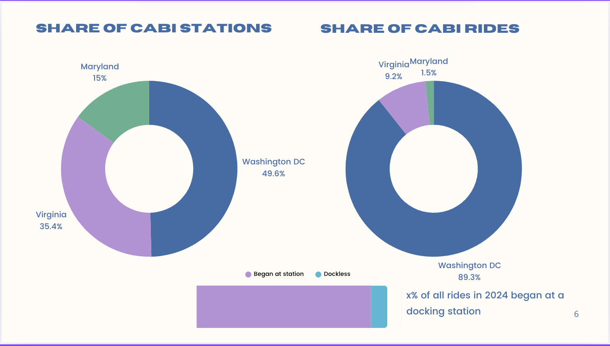
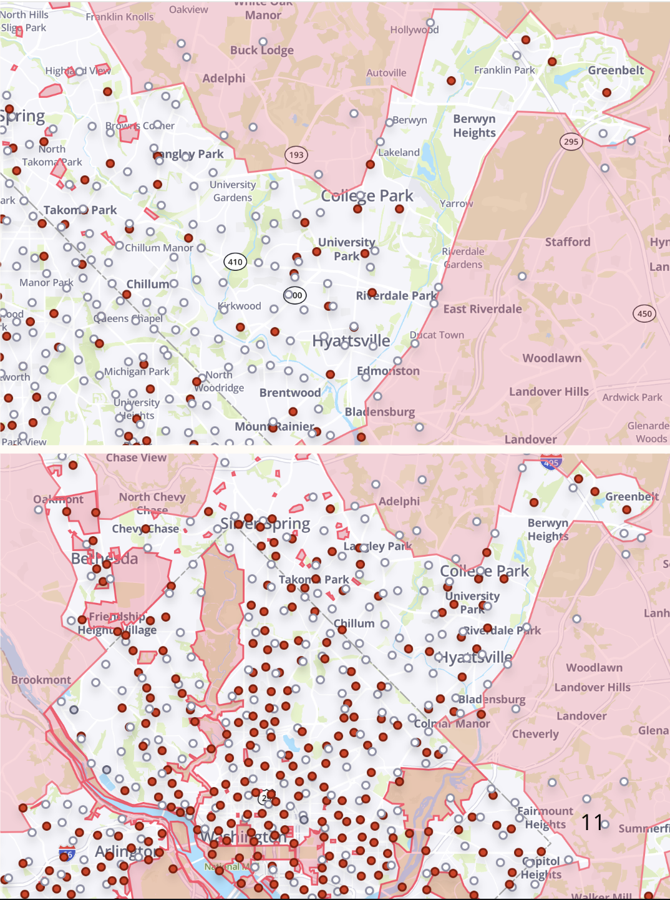

# 🚴 Capital Bikeshare Demand Analysis

This project analyzes **bike ride demand** of Capital Bikeshare (CaBi) system in the Washington DC and Metropolitan area using spatial features.  
It explores how **bike station location** and it's **proximity** to other bike stations, public transport, commercial corridors, etc. influence ride volume.

# About Cabi
Capital Bikeshare is a bike-sharing company that operates in the Washington, D.C. metropolitan area, including parts of Virginia and Maryland. It provides a network of docked bicycles that users can rent for short trips. 

CaBi broke the all-time monthly ridership record in August 2024 with 614,639 rides. This is a 31.1% increase in system use from August 2023 and marks the fourth consecutive month where CaBi has shattered its previous milestone for busiest month on record. The regional network has experienced year-over-year monthly ridership increases for 32 consecutive months. Annual ridership continues to thrive as 3,788,634 trips have been taken in 2024—a 31.3% increase from a year prior.

# Governance Structure
Publicly funded bike-sharing system owned by local governments in the Washington, D.C. metro area
Operated by Lyft, a private for-profit company, under a contract with the local jurisdictions
Funded through a mix of public funds, user fees, and sponsorships 


# Triggering questions: 

- What makes some of the bike stations busier than others? -What can we observe in the proximity of the busiest stations? 
- Why is the performance of Capital Bike share so much better in the DC area, compared to Maryland? 

With this questions in mind, after having an overview of the CaBi system in the whole region and doing some online research, I decided to focus in an area where it seems is not performing that well: Prince George County, Maryland.  

Online sources:
https://ggwash.org/view/97701/cabi-is-a-huge-success-will-its-structure-allow-it-to-keep-growing-regionally
https://ggwash.org/view/96982/bikeshare-beat-cabi-breaks-all-time-ridership-record-for-fourth-consecutive-month-in-august


# Prince George County / Washington DC comparison


---

## 📌 Project Overview

- 📍 **Primary Objectives:** 
  1) Analize the relationship (if any) between geographical location of a given station and ride demand
  2) Predict ride demand for given stations in a determined period of time
  3) Guide policy decision in station placement

- 🗃️ **Data Sources:**
  - Capital Bikeshare trip data for years 2021,2022,2023,2024 (https://s3.amazonaws.com/capitalbikeshare-data/index.html)
  - Washington and Maryland datasets with polygons and points representing: 
    - Cities, wards and neighborhoods boundaries
    - Public transport stations
    - Bike lanes
    - City centers
    - Historic landmark elements (for example: the Capitol, the White House, etc)
    - Commercial Corridors
    - Population density
  Most of them where sourced from https://opendata.dc.gov/datasets as Geojson .

---

## Methodoloy

### Data Collection
- Collected geographical information of Cabi stations,public transport stations, points of interest, distance to city center and population density
### Analizing
- Mapped the information in the map to get a visual representation.
- Calculated distances between the location parameters and the stations.
- Compared the results with the average number of rides per station.
### Testing
Deploy machine learning model to:
- Predict the demand 
- Optimize Station Placement

---

## 🔍 Key Insights


- Stations closer to each other, metro and other points of interest have consistently higher demand:


- If a bikeshare station is full or empty, another needs to be in proximity for bikeshare to be a reliable, go-to option to get around. That’s not the case in much of CaBi’s suburban service area like Prince George County, where officials often opt to sprinkle a few docks here or there without attention to whether station density makes bikeshare competitive with driving or even walking.

In Maryland, CaBi lacks coherence or the density necessary for a high-usage system:



Top: Bikeshare in western Prince George’s County

Bottom: Cabi in Washington, D.C

A lot of dockless bikes, indicated in white, very sparse stations, and a hole with no service at the University of Maryland.

- Machine Learning Predictions: 
  - Target : Prediction of bikes demand per station 
  - Features: Proximity to other bike stations, metro and points of interest. 
  - Period of time: weekly, from 2022 to 2024
  - Limit: Prince George County
  - Results: 
    - Mean Absolute Error: 4.49. Since the Mean Daily Rides is 16, the MAE is  25% off the mean. This mean the model is making pretty accurate predictions.
    - R² Score: 0.87 of the variance in daily rides is explained by your model
    - Mean Daily Rides: 16.33
    - Standard Deviation of Daily Rides: 19.25. The standard deviation of daily rides is 3.12, which is larger than the MAE. This suggests that your model is making much smaller errors than the natural variability in the data, indicating a strong fit.

---

## Actionable insights:

1) Rank stations by predicted ride demand and identify the top 10% busiest stations.
Ensure high-demand stations have enough bikes/docks to meet peak demand.
Consider adding more stations nearby if existing ones are frequently at capacity.

2) if near-metro stations consistently show higher demand, prioritize new stations near transit hubs.
If demand is low near POIs, consider marketing efforts or incentives to boost usage.

3) Identify the bottom 10% least-used stations.
Analyze their distance to metro, POIs, and population density to understand why demand is low.
Consider relocating low-use stations to denser areas or adjusting marketing strategies.

## 🧪 Techniques Used

- Pandas, GeoPandas, Matplotlib, Folium
- Distance calculations with geospatial data
- Machine Learning
- Time series aggregation
- Data visualization & clustering

---

## 📂 Project Structure

```bash
capital-bikeshare-analysis/
├── notebooks/               # Jupyter notebooks for EDA and modeling
├── src/                     # Utility functions (e.g., geo_distance.py)
├── data/                    # Cleaned or sample data files
├── images/                  # Output maps/graphs for README
├── requirements.txt
└── README.md
